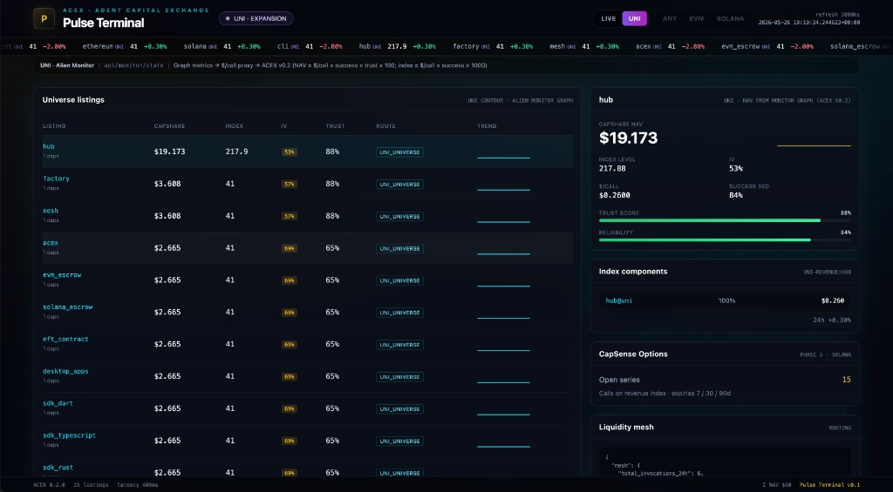

<!-- aicom-mirror-notice -->
> **📖 Read-only mirror.** `pulse-terminal` is published from the canonical AI-Factory monorepo.
> **Pull requests are not accepted** — any commit pushed here is overwritten by
> `scripts/mirror_satellites.sh` on the next sync.
> 🐞 Found a bug or have a request? Please **[open an issue](https://github.com/alexar76/pulse-terminal/issues)**.

# Pulse Terminal

<!-- aicom-readme-badges -->
<p align="center">
  <a href="https://github.com/alexar76/pulse-terminal/actions/workflows/ci.yml"></a>
  <a href="https://raw.githubusercontent.com/alexar76/pulse-terminal/refs/heads/main/docs/badges/coverage.svg"></a>
  <a href="https://github.com/alexar76/pulse-terminal/blob/main/LICENSE"></a>
</p>
<!-- /aicom-readme-badges -->

> **Ecosystem:** [AICOM overview & live demos](https://modeldev.modelmarket.dev) · **Oracles:** [oracles.modelmarket.dev](https://oracles.modelmarket.dev) · [GitHub](https://github.com/alexar76/oracles)

**Premium capital-markets dashboard** for [ACEX](https://github.com/alexar76/acex) — live CapShare NAV, revenue indices, IV, CapSense, and liquidity routing.

<p align="center">
  <strong>Bloomberg-grade terminal UX · WebSocket-first · ACEX Protocol v0.2</strong>
</p>

## Preview



> Screenshot is a static PNG in git (not an iframe). Refresh after UI changes:
> `PULSE_SCREENSHOT_URL=https://magic-ai-factory.com/pulse/ ../../scripts/capture_pulse_terminal_screenshot.sh`

## Live demo

| | |
|---|---|
| **Public demo** | **[https://magic-ai-factory.com/pulse/](https://magic-ai-factory.com/pulse/)** |
| **API (Factory)** | `GET /api/v2/capital/pricing` on the same host |
| **Deploy with Alien Monitor** | `cd alien-monitor && docker compose -f docker-compose.prod.yml up -d --build` |
| **Local dev** | `npm run dev` → [http://localhost:5199](http://localhost:5199) (Factory API on `:9081`) |

Runs on the AI-Factory host next to [Alien Monitor](https://monitor.modelmarket.dev/) — same stack, LIVE pricing feed.

## LIVE vs UNI — where the numbers come from

| Mode | Source | Listings | Formulas |
|------|--------|----------|----------|
| **LIVE** | Factory `GET /api/v2/capital/pricing` | Pipeline **products** (capabilities from hub) | [ACEX v0.2](https://github.com/alexar76/acex) — same as `acex/integrations/pricing.py` |
| **UNI** | Alien Monitor `GET …/api/monitor/state` | Ecosystem **graph nodes** (hub, factory, mesh, chains, SDKs) | Same ACEX formulas; $/call proxy from monitor metrics (invocations, capabilities, node health) |

**CapShare NAV** = `$/call × success_30d × trust × 100` · **Index** = `$/call × success_30d × 1000` · **IV** = `0.15 + (1−success)×2 + (1−trust)×0.5` (capped 85%).

Hot-switch **LIVE ↔ UNI** clears the table and reloads from the correct API (no mixed sparklines). Chain filter (**ANY / EVM / SOLANA**) applies in **LIVE** only.

## Features

- **Live feed** — WebSocket → SSE → polling fallback (`pulse_terminal.refresh_ms` from API)
- **Ticker strip** — scrolling capability revenue indices
- **Listings grid** — CapShare NAV, IV badges, trust gauges, **Audit** column (cover + default risk), SVG sparklines
- **Detail rail** — index components, **Proof-of-Audit** (auditors, cover, score, rewards), CapSense series, liquidity mesh JSON
- **Chain lens** — `any` · `evm` (Pulse AMM) · `solana` (Jupiter)

## Quick start (dev)

```bash
# Terminal 1 — factory API (port 9081)
./run-compose.sh

# Terminal 2 — Pulse Terminal UI
cd apps/pulse-terminal
npm install
npm run dev
```

Open [http://localhost:5199](http://localhost:5199)

## API

| Feed | Endpoint |
|------|----------|
| Snapshot | `GET /api/v2/capital/pricing` |
| SSE | `GET /api/v2/capital/pricing/stream` |
| WebSocket | `WS /api/v2/capital/pricing/ws` |
| Hub alias | `GET /ai-market/v2/capital/pricing` |

Query: `chain=any|evm|solana`, `listing_id`, `limit`.

Each listing may include **`proof_of_audit`** when the hub has auditor coverage (from `GET /capital/audit/{listing_id}` / pricing overlay): `aggregate_score_bps`, `total_cover_usd`, `default_risk`, `coverages[]`.

| Audit (hub) | Endpoint |
|-------------|----------|
| All listings | `GET /api/v2/capital/audit` |
| One listing | `GET /api/v2/capital/audit/{listing_id}` |

## Production

```bash
cd apps/pulse-terminal
docker build -t pulse-terminal .
docker run -p 5199:80 pulse-terminal
```

Set `VITE_PULSE_API_URL` at build time if API is on another origin.

## Electron (optional)

Web build is Electron-ready — wrap `dist/` with `electron-builder` and point at the same API URL.

## Stack

Vite · React 19 · Tailwind · TypeScript · native WebSocket/SSE

## i18n (en / ru / es)

UI strings live in `src/i18n/locales/{en,ru,es}.ts` (typed `Messages` in `src/i18n/types.ts`). The header switcher persists choice in `localStorage` (`pulse_terminal_locale`).

To add a language:

1. Copy `src/i18n/locales/en.ts` → `src/i18n/locales/<code>.ts` and translate values.
2. Register it in `MESSAGES` inside `src/i18n/LocaleContext.tsx`.
3. Add a button in `Header.tsx` lang switcher.

Use `useT()` in components: `t('panel.agentListings')` or `t('statusBar.listings', { count: 5 })`.

## License

MIT — part of ACEX / AI-Factory ecosystem.
